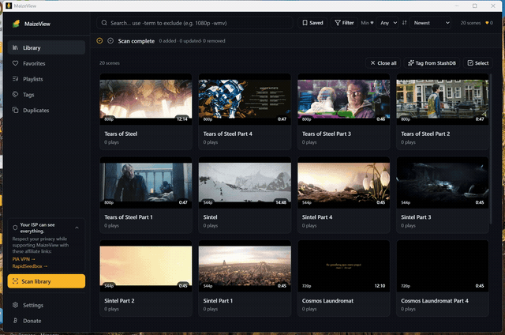

# MaizeView

[](https://github.com/MaizeMedia/MaizeView/actions/workflows/ci.yml)
[](https://github.com/MaizeMedia/MaizeView/releases)
[](LICENSE)

A Windows desktop app for cataloging and — more importantly — **watching** a large local adult video library. Built viewer-first: multi-window playback, a four-up 4Play mode, and a weighted shuffle that actually learns what you like, backed by real library tooling (metadata identify, duplicate detection, transcode/downscale).

Free and open source (MIT). No accounts, no telemetry, no background network calls — the only requests the app makes are ones you ask for.


## Highlights

- **4Play** — one window playing **four videos at once** in quadrants: per-pane prev/next with history, seek bars with hover thumbnails and live scrub, click-to-solo audio, EOF auto-rotation (weighted when the playlist shuffles), fullscreen, auto-hiding chrome.
- **Multi-window playback** — any number of independent player windows, each with its own queue and weighted shuffle (favorite bias × recency decay × session cooldown).
- **Library that manages itself** — scan folders into a catalog with generated preview sprites + scrub thumbnails; favorites, tags, playlists, saved filters, duplicates view.
- **Stash-box identify** — match scenes against StashDB-compatible metadata providers by fingerprint (OSHash/MD5/pHash) with a review-first needs-review flow and false-positive unlink/reject tools.
- **Convert / downscale** — batch transcode to smaller resolutions with NVENC/CUDA support and verify-before-replace safety.
- **Background jobs that behave** — parallel previews/hashes with per-drive caps, cancel support, and a shared worker budget.



<sub>Demo footage: Blender Foundation open movies (*Big Buck Bunny*, *Sintel*, *Tears of Steel*, *Cosmos Laundromat*), [CC-BY 3.0](https://creativecommons.org/licenses/by/3.0/).</sub>

## Download

Grab the latest installer (NSIS `.exe` or MSI) from [**Releases**](https://github.com/MaizeMedia/MaizeView/releases). Windows 10/11 x64.

> **Note:** the installers aren't code-signed, so Windows SmartScreen will warn on first run ("Windows protected your PC"). Click **More info → Run anyway** — the build comes straight from this repo's source (see `docs/release-build.md` for how it's produced).

## Stack

| Layer | Tech |
|---|---|
| Shell | Tauri 2 (Rust, multi-window) |
| Frontend | Svelte 5 + Vite (multi-entry) + Tailwind 4 |
| Data | SQLite (sqlx) + FTS5 full-text search |
| Playback | libmpv (`tauri-plugin-libmpv`), D3D11, hardware decode |
| Media jobs | FFmpeg / FFprobe |

## Develop

```bash
npm install
npx tauri-plugin-libmpv-api setup-lib   # fetches the libmpv DLLs (gitignored)
npm run tauri dev
```

Tests: `cd src-tauri && cargo test --lib` (Rust) and `npm run test:e2e:smoke` (Playwright/CDP against the real app — see `docs/e2e.md`).

## Docs

`docs/` carries the architecture and setup docs: `plan.md`, `decisions.md` (ADRs), `setup.md`, `e2e.md`, release notes. The day-to-day development log is kept private (see `docs/progress.md`).

## Support

MaizeView is a passion project. If it's useful to you, there's a Support popover in the app (BTC / XMR, fully offline) — or see the addresses there. You can also back development on [Patreon](https://www.patreon.com/cw/MaizeMedia) (free follow, $3 and $8 tiers). No pressure either way. Issues and PRs are welcome (see [CONTRIBUTING.md](CONTRIBUTING.md)); reviews happen as time allows, no SLA.

## A note on authorship

Unless noted otherwise, all code in this repo was written by an AI pair-programmer under human direction. Product decisions, testing, review, and maintenance are human-owned.

## License

[MIT](LICENSE) — © 2026 MaizeMedia
